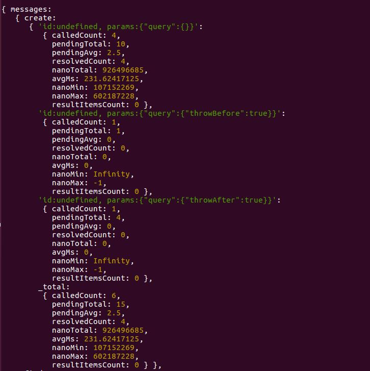

# feathers-logger-profiler
*Log service calls and gather profile information on them.*

[](https://travis-ci.org/feathersjs/feathers-logger-profiler)
[](https://codeclimate.com/github/feathersjs/feathers-logger-profiler)
[](https://codeclimate.com/github/feathersjs/feathers-logger-profiler/coverage)
[](https://david-dm.org/feathersjs/feathers-logger-profiler)
[](https://www.npmjs.com/package/feathers-logger-profiler)
[](http://slack.feathersjs.com)


## Summary

Express middleware loggers will not log service calls transported by websockets.
`feathers-logger-profiler` logs all service calls
and gathers performance information on them.

### `app.configure(loggerStats(options))`

Start logging and/or profiling service calls.

__Options:__

- logger
    - defaults to logging on `console.log`.
    - `null` disables logging.
    - `require('winston')` routes logs to the popular winston logger.
    - `{ log: payload => {} }` routes logs to your customized logger.
- logMsg
    - default message is shown [below](#logs-service-calls).
    - `hook => {}` returns a custom string or object payload for the logger.
    `hook._log` contains log information;
    `hook.original` and `hook.error` contain error information.
- stats
    - `null` or `'none'` profile information will not be gathered.
    - `total` gathers profile information by service and method only. The default.
    - `detail` gathers profile information by characteristics of the call.
- statsDetail
    - default is shown [below](#gathers-profile-information-on-service-calls).
    - `hook => {}` returns a custom category for the call.
    
### `getPending()`

Return the number of currently pending service calls.

### `getStats()`

Return service call profile as an object.

### `clearCache()`

Re-initializes the profile.
The profile counts will not add up perfectly if `getPending) !== 0`
at the time of re-initialization.

### `timestamp()`

Returns a timestamp suitable for logging to the console.

## Example

```js
const feathers = require('feathers');
const rest = require('feathers-rest');
const sockets = require('feathers-socketio');
const hooks = require('feathers-hooks');
const bodyParser = require('body-parser');
const errorHandler = require('feathers-errors/handler');

const { loggerProfiler, getPending, getStats}  = require('feathers-logger-profiler');

// Initialize the application
const app = feathers()
  .configure(rest())
  .configure(sockets())
  .configure(hooks())
  .use(bodyParser.json()) // Needed for parsing bodies (login)
  .use(bodyParser.urlencoded({ extended: true }))
  .use('users', { ...}) // services
  .use('messages', { ... })
  .configure(loggerProfiler({ stats: 'detail' }) // must be configured after all services
  .use(errorHandler());
  
  // ... once multiple service calls have been made
  console.log('pending', getPending());
  console.log(require('util').inspect(getStats(), {
    depth: 5,
    colors: true
  }));
```

## Usage

### Logs service calls

The log message may be customized. The default log message includes:

- Service name, method and transport provider.
- Elapsed time between the method being called and its completion.
- Number of service calls pending when call was made.
- Where service call failed and why.


### Gathers profile information on service calls

Profile information is:

- Grouped by service and method.
- Grouped by characteristics of the call. These may be customized.
- Average pending count provides information on how busy the server was during these calls.
- Average, min and max elapsed time provide information on how responsive the server is.
- The number of returned items provides information on how large the `find` results were.


